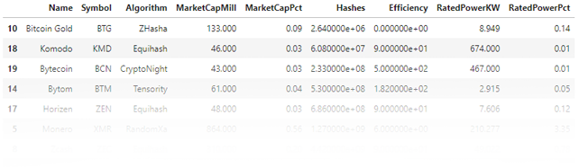
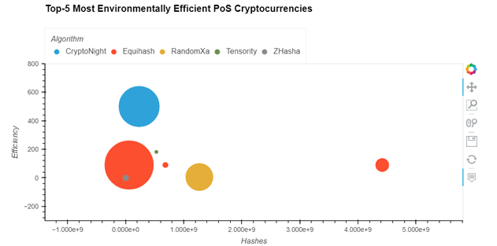
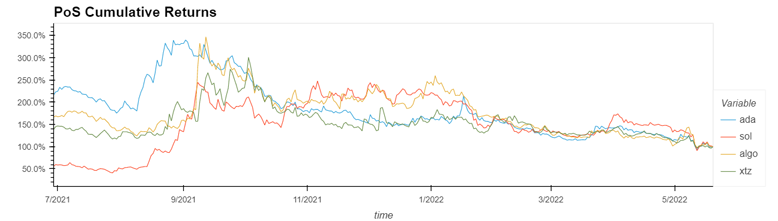
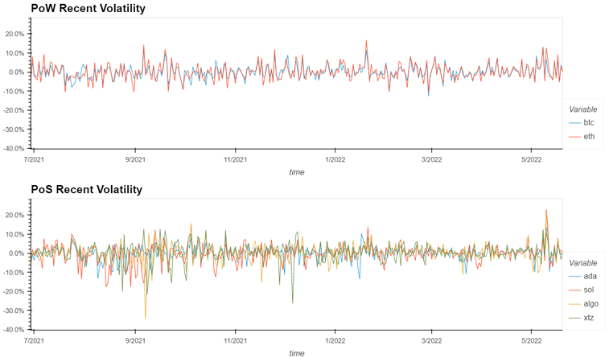
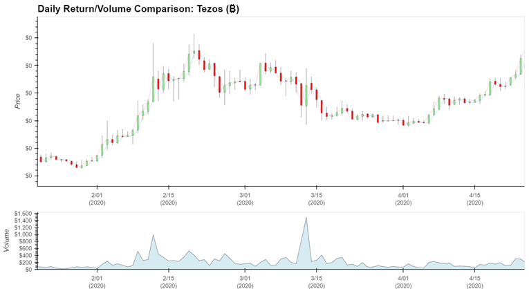

# Cryptocurrency for Energy Conscious Investors

Use this as a template for presenting findings. (Protfolio analysis using PoW, PoS and Hybrid Consensus Protocols)

## Executive Summary

In the cryptocurrency market, there are two known leaders who are dominating– Bitcoin and Ethereum. According to TradingView, as of today Bitcoin has about 45% of the cryptocurrency market with a market value of 570.252 billion USD, while Ethereum coins are worth approximately 243.536 billion USD or 19.7%. Together, these coins make up over 64% of the total cryptocurrency market. Both consume as much energy as an entire mid-size country. These facts led us to hypothesis that there are other eco-friendlier cryptocurrencies or “EcoCryptos” that energy conscious investors should consider adopting into their portfolios?

We believe that there is an emerging group of eco-conscious investors out there, who value both profit and the environment, and would utilize tools to determine eco-friendliness of cryptocurrencies in the present market for investment picks.



## Proposal

The goal of our project is to investigate and compare eco-friendly blockchain technologies to traditional/non-eco-friendly blockchain technologies. To distinguish eco-friendly blockchain/crypto protocols from non-eco-friendly ones, we will need to define them. The first thing that comes to mind is the topic of blockchain energy consumption and evaluating their energy efficiency, which is the use of less energy to perform the same task or produce the same result.

As the topic of energy consumption with blockchain technologies has recently gained media attention, particularly in relation to Bitcoin's energy consumption, energy efficient and sustainable technology has sparked discussion and debate about blockchain's ability to be a sustainable ecosystem. We are looking holistically at all types of blockchains: Proof-of-Work, Proof-of-Stake, hybrids.

Given that the technologies underlying cryptocurrency are powered by electricity, industries are starting to decarbonize their operations in order to facilitate widespread, sustainable industry growth. Future research in decarbonization initiatives and the Crypto Climate Accord were launched as a private sector-led initiative for the entire crypto community focused on decarbonizing the cryptocurrency industry in record time.



## Recomendations

**(should this be moved to the bottom? I'm not sure.)**

When deciding on the underlying technology for developing their necessary digital infrastructure, businesses, local, state, and national governments should consider the energy consumption and efficiency of blockchain. Scalability and performance in terms of energy efficiency are closely related. In the future, there should be a focus on maximizing the use of renewable energy to meet the energy demand of blockchain-based solutions. The energy efficiency (energy consumption) of blockchain solutions is closely related to the underlying mechanism used to achieve network consensus. Other types of consensus mechanisms and verification protocols should be developed to avoid excessive energy consumption as cryptocurrency becomes more popular and heavily invested in.

References:

###### (1) https://www.tradingview.com/symbols/CRYPTOCAP-BTC.D/ as of 5/22/22
###### (2) https://www.tradingview.com/symbols/CRYPTOCAP-ETH/ as of 5/22/22
###### (3) https://www.fool.com/investing/stock-market/market-sectors/financials/cryptocurrency-stocks/eco-friendly-cryptocurrency/ retrieved 5/22/22 written on 5/12/22

### Quantatative Analysis ###

We've created a DataFrame for analysis by importing trade data. Then, we performed our quantitative analysis which includes the following:

- Performance



- Volatility



- Risk



- Diversification


## Conclusion ##

When deciding on the underlying technology for developing their necessary digital infrastructure, businesses, local, state, and national governments should consider the energy consumption and efficiency of blockchain. Scalability and performance in terms of energy efficiency are closely related. In the future, there should be a focus on maximizing the use of renewable energy to meet the energy demand of blockchain-based solutions. The energy efficiency (energy consumption) of blockchain solutions is closely related to the underlying mechanism used to achieve network consensus. Other types of consensus mechanisms and verification protocols should be developed to avoid excessive energy consumption as cryptocurrency becomes more popular and heavily invested in.

## Technologies ##

- python
- jupyterlab
- pandas
- numpy
- matplotlib
- MCSimulation
- Bokeh
- PyViz Holoviews

## Getting Started & Running the code...

1. Create a conda environment and activate it

**(base)**
```bash
conda create -n eco_portfolio python=3.7 anaconda -y
conda activate eco_portfolio

```
2. Install the required packages (make sure `eco_portfolio` is activated first)

**(eco_portfolio)**
```bash
python -m ipykernel install --user --name eco_portfolio
conda install -c conda-forge nodejs -y
pip install python-dotenv
conda install -c pyviz hvplot -y

```
3. Clone this repository, then clone and run the Jupyter notebook.

**(eco_portfolio)**
```bash
git clone git@github.com:harryo1968/ecocrypto_portfolio_analysis.git
cd eco_portfolio/
jupyter lab

```
